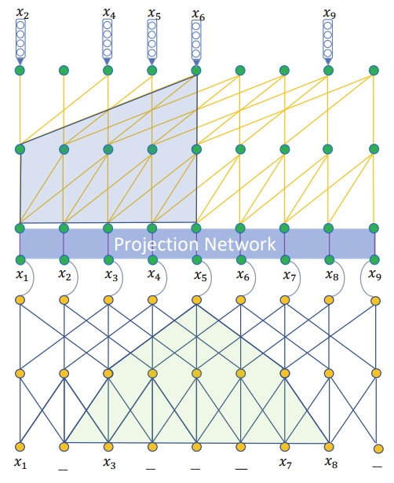

## Future Data Helps Training: Modeling Future Contexts for Session-based Recommendation
This is a PyTorch implementation of [Future Data Helps Training: Modelling Future Contexts for Session-based Recommendation](https://arxiv.org/pdf/1906.04473.pdf).

To capture the sequential dependencies, existing session-based recommender systems resort either to data augmentation techniques or left-to-right style autoregressive training. However, this work argues that the **future interactions** after a target interaction, which are also available during training, provide valuable signal on user preference and can be used to enhance the recommendation quality. 

To avoid data leakage while integrating future data into model training, this work proposes a new encoder-decoder framework named **Gap-filling based Recommender (GRec)**, which trains the encoder and decoder by a gap-filling mechanism.

  

## Implementation
NextItNet pytorch version: https://github.com/syiswell/NextItNet-Pytorch, of which architecture maybe useful to this work.

### Requirements
- Python 3.9, NVIDIA GPU or CPU
- PyTorch 1.11.0

## Run GRec
The hyperparameters used to train the GRec model are set default in the `argparse.ArgumentParser` and `model_para` in the `GRecTorch.py` file, you can change them if needed. Then simply run `python GRecTorch.py`.

## Reference
    @inproceedings{yuan2020future,
      title={Future Data Helps Training: Modeling Future Contexts for Session-based Recommendation},
      author={Yuan, Fajie and He, Xiangnan and Jiang, Haochuan and Guo, Guibing and Xiong, Jian and Xu, Zhezhao and Xiong,   Yilin},
      booktitle={Proceedings of The Web Conference 2020},
      pages={303--313},
      year={2020}
    }

